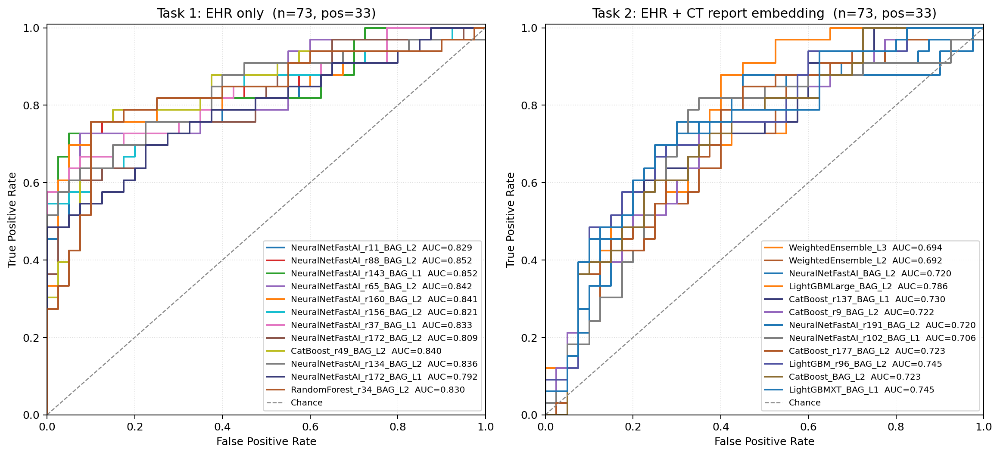
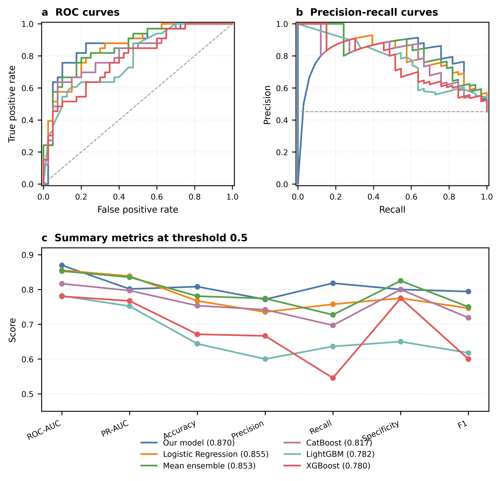
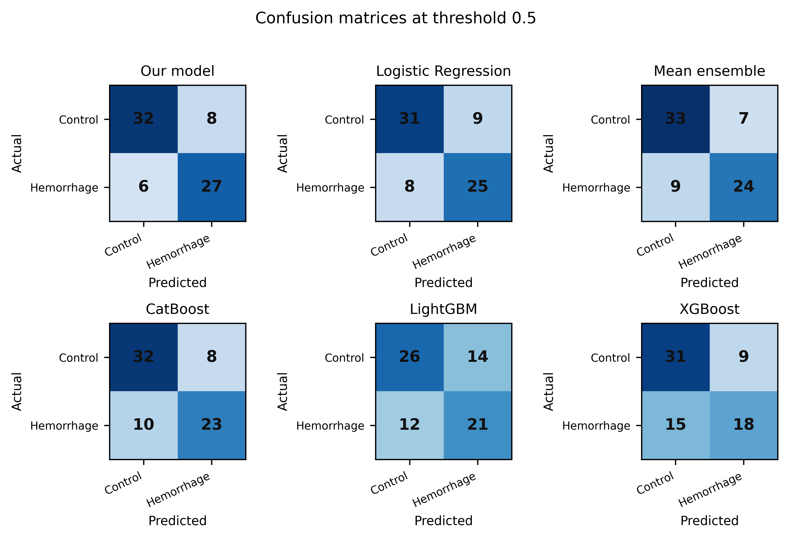
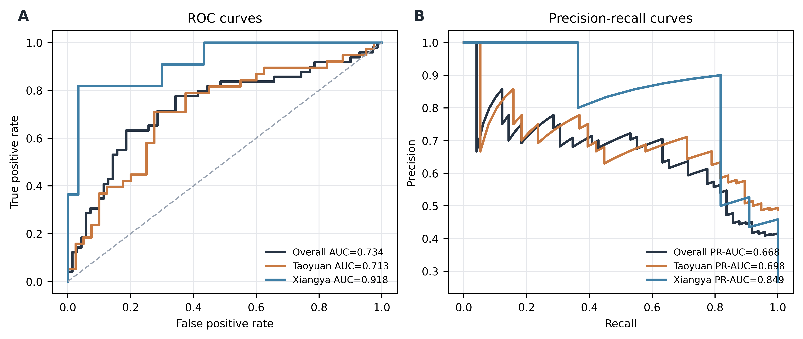
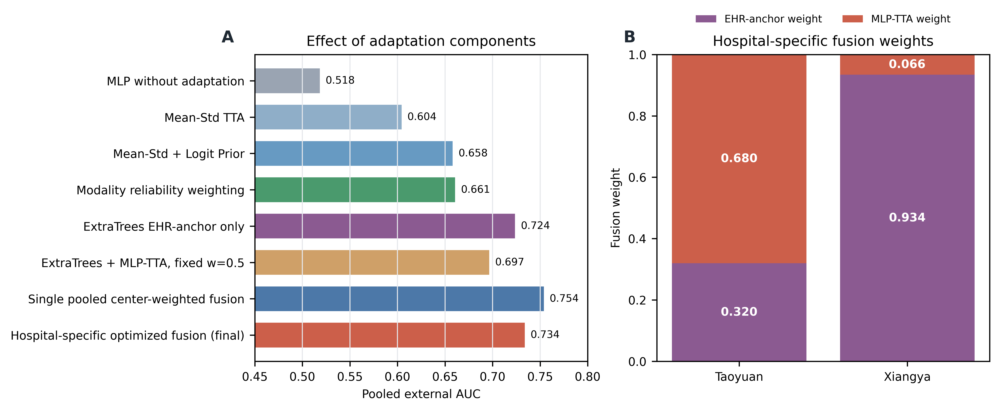

# CT-EHR Post-thrombolysis Hemorrhage Prediction

This repository contains code, split metadata, lightweight result tables, and figures for a four-task CT+EHR study of post-thrombolysis hemorrhage prediction.

## Tasks

- **Task 1: Pure EHR**: prediction using structured clinical/EHR variables.
- **Task 2: EHR + CT report text**: prediction using EHR variables plus CT textual diagnosis/report features.
- **Task 3: Pure CT**: prediction using CT imaging features/model outputs.
- **Task 4: Multimodal fusion**: final CT+EHR multimodal prediction, including MLP fusion and classical ML baselines.

## External Validation

External validation was performed on Xiangya and Taoyuan cohorts. The final external-validation strategy uses hospital-specific adaptation parameters:

```text
p_final,c = w_c * p_MLP-TTA,c + (1 - w_c) * p_EHR-anchor,c
```

Final center-wise results:

- Taoyuan: AUC 0.713, PR-AUC 0.698
- Xiangya: AUC 0.918, PR-AUC 0.849
- Pooled analysis: AUC 0.734, PR-AUC 0.668

## Repository Structure

```text
data/                         Lightweight split and ID mapping tables
src/                          Training, preprocessing, adaptation, and plotting scripts
results/task1_ehr/            Task 1 metrics, predictions, leaderboards
results/task2_ehr_ct_report/  Task 2 metrics, predictions, leaderboards
results/task3_ct/             Task 3 metrics and predictions
results/task4_multimodal/     Task 4 internal validation results
results/external_validation/  External validation and adaptation outputs
figures/                      ROC/PR, confusion matrices, model structure figures
docs/                         Notes for model artifacts and data availability
```

## Figure Gallery

All display figures are stored under the `figures/` directory.

### Task 1-3 Comparison



### Task 4 Internal Validation





### External Validation





## Data and Model Weights

Raw CT images and full clinical tables are not included. Only the final selected main model is included; all other model weights are excluded while scripts, parameters, metrics, and prediction outputs are retained for reproducibility. See `docs/MODEL_ARTIFACTS.md` and `docs/DATA_AVAILABILITY.md`.

## Notes

This package was created from the server workspace `/root/autodl-fs/lyy`. Only `models/final_main_model/task_04_multimodal_mlp_fusion.pt` is included as the final main model; other model artifacts are intentionally excluded to keep the repository lightweight and reproducible.
